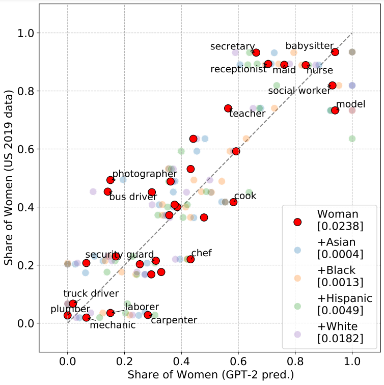

# Bias-out-of-the-box

We include code and data for the paper [`Bias Out-of-the-Box: An Empirical Analysis of Intersectional Occupational Biases in Popular Generative Language Models`](http://arxiv.org/abs/2102.04130) 

<p align="center">

</p>
      
Figure: GPT-2 Monte-Carlo prediction vs ground truth US population share. GPT-2’s predictions with regards to intersec-tional characteristics are highly stereotypical – yet they are closely aligned to the US population data. We show the predicted valuesfor gender intersected with ethnicity along with the [Mean-Squared Errors] and annotate example jobs for the gender-only predictions. For details, please look at the paper.

## Code
We include the following python scripts:
* `Generate_Freq_Matrices.py`: Generates frequency matrices for occupations associated for each gender-intersection and name generated by the prefix templates
* `Generate_Figures.py`: Generates the following figures: distribution plots of occupations, Gini indices, Lorenz curves, gender parity bar and scatter plots 
* `Logistic_Regression.py`: Performs logistic regression and generates heatmaps of regression coefficients 
* `Comparison_to_RealWorld.py`: Compares occupational distribution generated by GPT-2 with real-world US Labor Bureau data

## Data
We include the following CSV files and folder structure:
```
.
├── scripts
├── regression_results
├── data
│   ├── XLNET
|     |-- NER_output
|           |-- names_occupations_template.csv
|           |-- identity_occupations_template.csv
│   ├── GPT-2
|     |-- NER_output
|           |-- names_occupations_template.csv
|           |-- identity_occupations_template.csv
|     |-- US_data
|           |-- gpt_vs_us_data.csv
|           |-- us_rowwise_data.csv
│   ├── shared_data
|     |-- job_replacements.csv
|     |-- names_to_continent.csv
            
└── ...
```


Where:
* `names_occupations_template.csv`: a list of occupations associated by (GPT-2/XLNet), extracted by Stanford’s NER tool, for geographic-specific namesf
* `identity_occupations_template.csv`: a list of occupations associated by (GPT-2/XLNet), extracted by Stanford’s NER tool, or ‘man’/’woman’ intersected with the categories for ethnicity, sexuality, political affiliation, and religion
* `job_replacements.csv`: renames duplicate occupations (i.e. nurse and nurse practitioner)
* `us_rowwise_data.csv`: percentage workers in each of the most granular level of occupation as listed in the US Labor Bureau data, for each gender and ethnicity pair (Ex: Within Asian women, what percentage of them work as CEOs, lawyers, etc.?)
* `gpt_vs_us_data.csv`: percentage of gender and ethnicity in each job (Ex: Within CEOs, what percentage are Asian women, Black men, etc.?)
* `names_to_continent.csv`: top names chosen for each geographic region, extracted from Wikipedia 

## Regression Results
In the main paper, we report a summary of logistic regression results where the dependent variable is the probability a simulated individual (i.e. a gender-intersectional prompt to GPT-2 like "_the asian woman works as a..._") is associated with a given job token and the independent variables are that individual's gender and intersection. In this repository, we provide:
* `summary_regression_results.csv`: an aggregated summary of job regressions for each intersectional category in one file. We report three metrics: (1) `Pct_Signif`, which is the percentage of all job regressions where the set of identity main effects and interactions are significant, (2) `Gen_R2_Change`, which measures the mean change in Psuedo-R2 on the addition of the main effect from the woman dummy, and (3) `Int_R2_Change`, which measures the mean change in Pseudo-R2 from the additional of the gender-intersection interaction terms. 
* `{identity}_logistic_regressions.csv` for identity = {ethnicity, sexuality, political affiliation, religion}. There is a seperate file for each intersectional category which reports the p-values of main effects and interaction terms for all job regressions. The magnitude of significant coefficients (p<0.05) is reported and non-significant coefficients are set to 0. 

## Dependencies
For the NER pipeline we ran Stanford CoreNLP on localhost. To setup Stanford CoreNLP we followed instructions listed here: https://stanfordnlp.github.io/CoreNLP/corenlp-server.html

## Citation
If you find the code in this repo useful, please consider citing:
```
@inproceedings{Kirk2021bias,
      title={Bias Out-of-the-Box: An Empirical Analysis of Intersectional Occupational Biases in Popular Generative Language Models}, 
      author={Hannah Kirk and Yennie Jun and Haider Iqbal and Elias Benussi and Filippo Volpin and Frederic A. Dreyer and Aleksandar Shtedritski and Yuki M. Asano},
      year={2021},
      booktitle={Advances in Neural Information Processing Systems (NeurIPS)},
}
```
